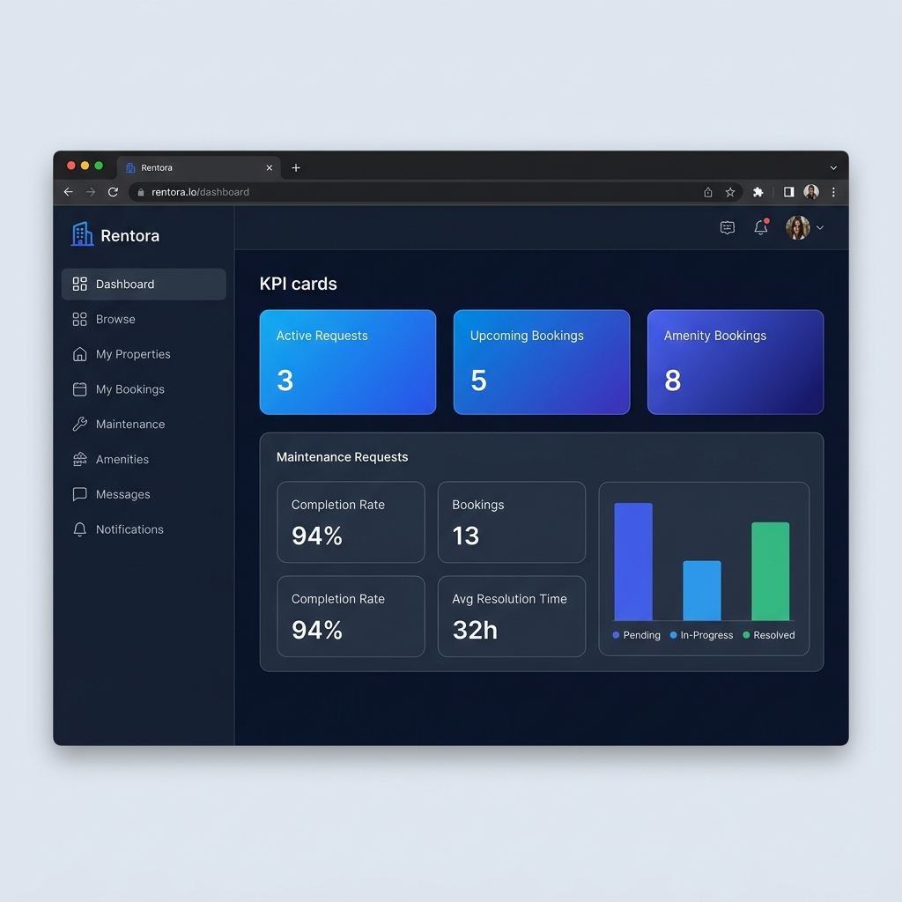
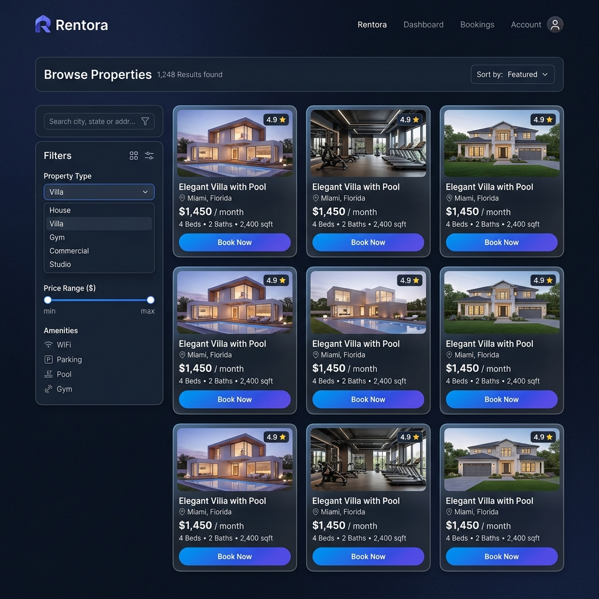

<div align="center">


<br/><br/>

<h1>🏠 Rentora</h1>
<p><strong>Premium Real-Time Property Rental, Maintenance &amp; Amenity Management Platform</strong></p>

<p>
  Rentora is a full-stack, role-based property management web application built for landlords, tenants, and administrators.
  It handles everything from property listings and amenity bookings to real-time maintenance tracking, in-app messaging,
  and Redis-powered KPI dashboards — all wrapped in a modern, dark glassmorphism UI.
</p>

</div>

---

## 📸 Screenshots

| Dashboard | Browse Properties |
|:---:|:---:|
|  |  |

> 📝 *Replace the above placeholders with real screenshots after deploying locally.*

---

## ✨ Features

### 🔐 Authentication & Security
- Email/password registration with **OTP-based email verification** (via Nodemailer)
- **Google OAuth 2.0** sign-in and sign-up (`google-auth-library`)
- JWT-based dual-token system: **access token (15 min)** + **refresh token (7 days)** in HttpOnly cookies
- Automatic token refresh via Axios response interceptor (silent re-auth on 401)
- Token **blacklisting on logout** stored in Redis (per-token TTL expiry)
- **Redis Sliding Window Rate Limiter** on all auth endpoints:
  - Strict: 5 req / 15 min — login, register, forgot/reset password, Google auth
  - Moderate: 10 req / 15 min — OTP verify, OTP resend
  - Loose: 30 req / min — token refresh
- OTP cooldown enforcement (60s resend cooldown per email)
- Forgot Password & Reset Password via OTP email flow
- Change password (authenticated users)
- Profile picture upload via Cloudinary

### 🏘️ Property Management
- **Landlords** can create, update, and delete properties
- Property types: `gym`, `house`, `villa`, `swimmingpool`, `commercial`, `other`
- Multiple image upload (Multer → Cloudinary, max 5 images)
- Pricing: hourly or monthly rent types, with security deposit
- Tenant request system: tenants request to join, landlords accept/reject
- **Server-side paginated** property listings (`?page=&limit=`, default 12/page, max 50)
- Redis cache for property listings (cache-busting on mutation)

### 🔍 Property Discovery
- **Browse Properties** (`/explore`): all available properties for any authenticated user
- **My Rentals** (`/my-rentals`): tenant's current rented properties with owner contact info
- **My Properties** (`/properties`): landlord's owned listings with full CRUD

### 📅 Booking System
- **Amenity bookings**: book time slots at a property's amenity (gym, pool, etc.)
- **Property bookings**: book entire property for a time range
- **Slot availability** checking to prevent double-booking (server-side overlap validation)
- Booking lifecycle: `pending` → `booked` → `checked_in` → `completed` / `cancelled`
- Landlord can **approve or reject** bookings
- Tenant can **request cancellation**; landlord approves/rejects
- Check-in and check-out flow
- Server-side paginated booking list (`?page=&limit=`, default 20/page)

### 🔧 Maintenance Management
- Tenants submit maintenance requests (title, description, category, optional image)
- Categories: `plumbing`, `electrical`, `cleaning`, `others`
- Permission check: only current tenants or users with active bookings can submit
- Image upload to Cloudinary (`rentora_maintenance` folder)
- **Status workflow**: `pending` → `assigned` → `in_progress` → `resolved` / `cancelled`
- Landlord/Admin can **assign a staff member** (by User ID) to a request
- Real-time **Socket.IO push notification** to tenant on status change or staff assignment
- **KPI Endpoint** (`GET /api/maintenance/kpi`):
  - Total / resolved / pending / in-progress counts
  - Completion Rate % (target: ≥ 90%)
  - Average Resolution Time in hours (SLA target: ≤ 48 h)
  - `meetsSLA` boolean flag
- Role-scoped: tenants see their own, landlords see their properties', admins see all

### 🏋️ Amenity Management
- Landlords create and manage amenities per property
- Fields: name, description, category, capacity, pricePerHour, openingHour, closingHour, images
- Slot duration configuration; active/inactive toggle
- Any authenticated user can view amenities

### 💬 Real-Time Messaging
- Direct messaging between any two users via **Socket.IO**
- Messages stored in MongoDB (sender, receiver, text, read)
- Real-time delivery (`send_message` / `new_message` events)
- Sender acknowledgment (`message_sent` event)
- Read receipts (`mark_read` / `messages_read` events)
- Left panel shows conversation list

### 🔔 Notifications
- Persistent notification records in MongoDB with **14 event types** (tenant/booking/maintenance/role lifecycle)
- Real-time toast notifications via Socket.IO (auto-dismiss after 6 s)
- Notification badge in sidebar and topbar with unread count
- "Mark all as read" (clears dashboard Redis cache)
- Dedicated `/notifications` page with full history

### 📊 Dashboard & KPIs
- **Role-aware dashboard** (different data for tenant / landlord / admin)
- Tenant: active requests, upcoming bookings, current booking, rented properties
- Landlord: pending bookings, pending tenant requests, maintenance count
- Admin: all-platform maintenance stats
- **3 KPI Widgets**: Completion Rate (color-coded), Avg Resolution Time (SLA badge), Request Breakdown
- Recent maintenance requests (top 3); upcoming bookings list (top 5)
- Dashboard data cached in Redis (10 min TTL, auto-invalidated on write)

### 🛡️ Admin Panel (`/admin`)
- Exclusive to `admin` role users
- KPI cards: Total requests, Completion %, Avg Resolution Time, Active count
- Color-coded SLA indicators (green = within 48 h, red = breach)
- Overview tab + full maintenance request list

### 👤 User & Role Management
- Four roles: `tenant`, `landlord`, `admin`, `maintenance_staff`
- Users can **request a role change** from the sidebar (`requestedRole` field)
- Admins approve/deny via `PUT /api/users/:id/role`
- Profile update (name, phone), profile picture via Cloudinary

### 🎨 UI & UX
- Dark glassmorphism design with animated blobs on landing screen
- Collapsible sidebar with spring animations (Framer Motion)
- Topbar notification dropdown + profile dropdown
- Auto-dismissing toast notifications
- 404 page with gradient text and "Back to Rentora" button
- Role-based navigation items built dynamically per user role

---

## 🛠️ Tech Stack

| Layer | Technology |
|---|---|
| **Frontend Framework** | React 19 (Vite 8) |
| **UI Styling** | Tailwind CSS v4 (`@tailwindcss/vite`) |
| **Animations** | Framer Motion 12 |
| **Icons** | Lucide React |
| **Forms** | React Hook Form + Zod + `@hookform/resolvers` |
| **Routing** | React Router DOM v7 |
| **HTTP Client** | Axios (with auto-refresh interceptor) |
| **Real-Time (Client)** | Socket.IO Client v4 |
| **Backend Framework** | Express 5 |
| **Database** | MongoDB (Mongoose 9) |
| **Caching & Rate Limiting** | Redis v5 (Upstash / Redis Cloud) |
| **Real-Time (Server)** | Socket.IO v4 |
| **Authentication** | JWT (`jsonwebtoken`), bcrypt |
| **Google OAuth** | `google-auth-library` OAuth2Client |
| **Email** | Nodemailer (Gmail SMTP / custom SMTP) |
| **File Uploads** | Multer (memory storage) → Cloudinary v2 |
| **Input Validation** | `validator` (backend) |
| **Package Manager** | npm |
| **Dev Server** | Nodemon (backend), Vite HMR (frontend) |

---

## 🏗️ Architecture

```
┌───────────────────────────────────────────────────────────────────┐
│                      CLIENT  (React + Vite)                        │
│  Browser → Axios (HTTP + cookies) → /api/* endpoints              │
│  Browser ↔ Socket.IO Client ← Real-time events                   │
└───────────────────────┬───────────────────────────────────────────┘
                        │ HTTP / WebSocket
┌───────────────────────▼───────────────────────────────────────────┐
│                  SERVER  (Node + Express 5)                         │
│  Routes → Middleware (JWT + Redis blacklist check) → Controllers   │
│  Socket.IO Server: rooms per userId, notification/message events   │
└──────────┬────────────────────────────────┬───────────────────────┘
           │                                │
  ┌────────▼────────┐   ┌──────────────┐  ┌─────────────────┐
  │    MongoDB       │   │    Redis     │  │   Cloudinary    │
  │  (7 Mongoose    │   │  Cache +     │  │  Property &     │
  │   models)       │   │  RateLimit + │  │  Maintenance    │
  └─────────────────┘   │  Blacklist   │  │  images         │
                        └──────┬───────┘  └─────────────────┘
                               │
                      ┌────────▼────────┐
                      │   Nodemailer    │
                      │  (OTP / Reset) │
                      └─────────────────┘
```

### Request Flow (Authenticated)
1. Frontend calls API via `axiosInstance` (cookies carried automatically)
2. Auth middleware verifies JWT from `accessToken` cookie
3. Redis blacklist checked — rejected if token was explicitly logged out
4. `req.user` attached from MongoDB
5. Controller runs business logic, reads/writes Redis cache where applicable
6. Socket.IO pushes real-time events to specific user rooms
7. Response returned

### Auto Token Refresh
```
Request → 401  →  Axios interceptor  →  POST /auth/refresh
       →  new accessToken cookie  →  retry original request
       →  if refresh fails → clear localStorage → redirect /login
```

---

## 📁 Project Structure

```
Rentora/
├── frontend/
│   ├── src/
│   │   ├── App.jsx                # Root router — all 16 routes defined here
│   │   ├── index.css              # Global styles & glassmorphism tokens
│   │   ├── components/
│   │   │   ├── Layout.jsx         # Shell: sidebar + topbar + Socket.IO listener
│   │   │   ├── LeftPanel.jsx      # Messaging conversation list
│   │   │   ├── GoogleAuth.jsx     # Google Sign-In button
│   │   │   └── ui.jsx             # Avatar, Modal, Toast, GradientButton
│   │   ├── pages/
│   │   │   ├── Login.jsx
│   │   │   ├── Register.jsx
│   │   │   ├── VerifyEmail.jsx
│   │   │   ├── ForgotPassword.jsx
│   │   │   ├── Dashboard.jsx      # KPI widgets, role-aware stats
│   │   │   ├── FindProperties.jsx # Browse + My Rentals mode
│   │   │   ├── Properties.jsx     # Landlord CRUD
│   │   │   ├── Maintenance.jsx    # Request list + detail modal
│   │   │   ├── Amenities.jsx      # Amenity management + booking
│   │   │   ├── Bookings.jsx       # Booking history + management
│   │   │   ├── Messages.jsx       # Real-time chat
│   │   │   ├── Notifications.jsx  # Full notification history
│   │   │   ├── Profile.jsx
│   │   │   ├── Settings.jsx       # Preferences + change password
│   │   │   └── Admin.jsx          # Admin-only KPI panel
│   │   └── utility/
│   │       └── axiosInstance.js   # Axios + auto-refresh interceptor
│   ├── index.html                 # Loads Google GSI script
│   ├── vite.config.js
│   └── package.json
│
└── backend/
    └── src/
        ├── server.js              # Express, Socket.IO, MongoDB, Redis bootstrap
        ├── config/
        │   ├── db.js              # Mongoose connect
        │   ├── redis.js           # Redis client + reconnect strategy
        │   ├── cloudinary.js      # Cloudinary v2 config
        │   └── nodemailer.js      # SMTP transporter
        ├── models/
        │   ├── user.js            # Roles, googleId, isVerified, requestedRole
        │   ├── property.js        # Types, tenants, pricing, images
        │   ├── amenity.js         # Hours (int + legacy Date), capacity, price
        │   ├── maintainanceRequest.js  # Status, assignedStaff, SLA fields
        │   ├── booking.js         # 6-state status, amenity + property booking
        │   ├── notification.js    # 14 event types
        │   └── message.js         # Sender, receiver, text, read
        ├── controllers/
        │   ├── userAuthentication.js   # register/login/OTP/Google/JWT
        │   ├── propertyManagement.js   # CRUD + tenant management + pagination
        │   ├── bookingManagement.js    # Booking lifecycle + check-in/out
        │   ├── maintenanceController.js # CRUD + assignStaff + KPI
        │   ├── userAmenity.js          # Amenity CRUD
        │   ├── dashboardController.js  # Role-scoped data + Redis cache
        │   ├── messageController.js    # Message history REST
        │   └── userController.js      # User list, role request, picture upload
        ├── routes/
        │   ├── auth.js            # 3-tier rate limiting applied here
        │   ├── properties.js
        │   ├── amenities.js
        │   ├── bookings.js
        │   ├── maintenance.js
        │   ├── dashboard.js
        │   ├── messages.js
        │   └── users.js
        ├── middleware/
        │   ├── tenantmiddleware.js    # tenant + landlord + admin
        │   ├── landlordmiddleware.js  # landlord + admin
        │   ├── adminmiddleware.js     # admin only
        │   ├── rateLimiter.js         # Redis sliding-window ZSET limiter
        │   └── upload.js              # Multer memory storage
        └── utilities/
            ├── otpService.js          # OTP gen, Redis TTL, email dispatch
            └── validatorUser.js       # Registration input validation
```

---

## 🚀 Installation

### Prerequisites

| Tool | Version |
|---|---|
| Node.js | ≥ 18.x |
| npm | ≥ 9.x |
| MongoDB | Atlas or local ≥ 6.x |
| Redis | Upstash / Redis Cloud / local |
| Cloudinary Account | For image uploads |
| Google Cloud Project | For OAuth 2.0 (optional for dev) |
| Gmail Account | For Nodemailer SMTP |

### 1 · Clone

```bash
git clone https://github.com/your-username/rentora.git
cd rentora
```

### 2 · Backend

```bash
cd backend
npm install
# Create backend/.env with the variables listed below
npm run dev        # nodemon — hot reload
# npm start        # production
```

Backend starts at **`http://localhost:5000`**.

### 3 · Frontend

```bash
cd frontend
npm install
# Create frontend/.env with VITE_GOOGLE_CLIENT_ID
npm run dev
```

Frontend starts at **`http://localhost:5173`**.

---

## 🔑 Environment Variables

### `backend/.env`

| Variable | Description | Required |
|---|---|:---:|
| `PORT` | Express port (default `5000`) | No |
| `DB_CONNECT_STRING` | MongoDB Atlas URI | ✅ Yes |
| `JWT_ACCESS_SECRET` | Access token secret (15 min TTL) | ✅ Yes |
| `JWT_REFRESH_SECRET` | Refresh token secret (7 day TTL) | ✅ Yes |
| `REDIS_PASS` | Redis password | ✅ Yes |
| `REDIS_HOST` | Redis hostname | ✅ Yes |
| `REDIS_PORT` | Redis port | ✅ Yes |
| `GOOGLE_CLIENT_ID` | Google OAuth2 Client ID | ✅ Yes |
| `EMAIL_SERVICE` | e.g. `gmail` (used if `EMAIL_HOST` not set) | No |
| `EMAIL_HOST` | SMTP host for custom SMTP | No |
| `EMAIL_PORT` | SMTP port | No |
| `EMAIL_SECURE` | `true` for port 465 | No |
| `EMAIL_USER` | SMTP username / Gmail address | ✅ Yes |
| `EMAIL_PASS` | SMTP password / Gmail App Password | ✅ Yes |
| `CLOUDINARY_NAME` | Cloudinary cloud name | ✅ Yes |
| `CLOUDINARY_KEY` | Cloudinary API key | ✅ Yes |
| `CLOUDINARY_SECRET` | Cloudinary API secret | ✅ Yes |

> ⚠️ Both `.env` files are gitignored. Never commit real credentials.

### `frontend/.env`

| Variable | Description | Required |
|---|---|:---:|
| `VITE_GOOGLE_CLIENT_ID` | Google OAuth2 client ID (GSI button) | ✅ Yes |

---

## 📡 API Overview

All routes mounted at `/api/` (also mirrored without `/api` prefix for compatibility).

### Auth `/api/auth`

| Method | Endpoint | Rate Limit | Description |
|---|---|---|---|
| `POST` | `/register` | Strict 5/15 min | Register; sends OTP email |
| `POST` | `/login` | Strict 5/15 min | Login; issues JWT cookies |
| `POST` | `/logout` | — | Blacklists tokens, clears cookies |
| `POST` | `/refresh` | Loose 30/min | Issues new access token |
| `POST` | `/verify-otp` | Moderate 10/15 min | Verify OTP → issues JWT cookies |
| `POST` | `/resend-otp` | Moderate 10/15 min | Resend OTP (60 s cooldown) |
| `POST` | `/forgot-password` | Strict | Sends reset OTP |
| `POST` | `/reset-password` | Strict | Resets password via OTP |
| `POST` | `/google-login` | Strict | Google OAuth login |
| `POST` | `/google-register` | Strict | Google OAuth register |
| `PATCH` | `/profile` | tenantAuth | Update name / phone |
| `PATCH` | `/change-password` | tenantAuth | Change password |

### Properties `/api/properties`

| Method | Endpoint | Auth | Description |
|---|---|---|---|
| `GET` | `/` | tenant | Get all properties (paginated) |
| `POST` | `/` | landlord + upload | Create property with images |
| `PATCH` | `/:id` | landlord | Update property |
| `DELETE` | `/:id` | landlord | Delete property |
| `GET` | `/pending-requests` | landlord | Pending tenant join requests |
| `POST` | `/:id/tenants` | tenant | Request to join property |
| `POST` | `/:id/tenants/:tid/accept` | landlord | Accept tenant request |
| `POST` | `/:id/tenants/:tid/reject` | landlord | Reject tenant request |
| `DELETE` | `/:id/tenants/:tid` | tenant | Remove tenant |

### Bookings `/api/bookings`

| Method | Endpoint | Auth | Description |
|---|---|---|---|
| `POST` | `/book` | tenant | Book amenity slot |
| `POST` | `/property/book` | tenant | Book entire property |
| `GET` | `/my` | tenant | My bookings (paginated) |
| `PUT` | `/:id/approve` | landlord | Approve booking |
| `PUT` | `/:id/reject` | landlord | Reject booking |
| `PUT` | `/:id/approve-cancellation` | landlord | Approve cancellation |
| `PUT` | `/:id/reject-cancellation` | landlord | Reject cancellation |
| `POST` | `/:id/checkin` | tenant | Check in |
| `POST` | `/:id/checkout` | tenant | Check out |
| `DELETE` | `/:id` | tenant | Cancel booking |
| `GET` | `/amenity/:aid/availability` | tenant | Amenity slot availability |
| `GET` | `/property/:pid/availability` | tenant | Property availability |

### Maintenance `/api/maintenance`

| Method | Endpoint | Auth | Description |
|---|---|---|---|
| `GET` | `/kpi` | tenant | KPI stats (role-scoped) |
| `POST` | `/` | tenant + upload | Submit request with optional image |
| `GET` | `/` | tenant | Get requests (role-scoped) |
| `PUT` | `/:id/status` | tenant | Update status + resolution notes |
| `PUT` | `/:id/assign` | landlord | Assign staff member |
| `POST` | `/:id/review` | tenant | Submit rating + feedback |

### Amenities `/api/amenities`

| Method | Endpoint | Auth | Description |
|---|---|---|---|
| `POST` | `/` | landlord | Create amenity |
| `GET` | `/` | tenant | List amenities |
| `GET` | `/:id` | tenant | Get amenity |
| `PATCH` | `/:id` | landlord | Update amenity |
| `DELETE` | `/:id` | landlord | Delete amenity |

### Dashboard `/api/dashboard`

| Method | Endpoint | Auth | Description |
|---|---|---|---|
| `GET` | `/` | tenant | Role-scoped dashboard (Redis cached 10 min) |
| `PUT` | `/notifications/mark-read` | tenant | Mark all notifications read |

### Users `/api/users`

| Method | Endpoint | Auth | Description |
|---|---|---|---|
| `GET` | `/` | auth | List users |
| `POST` | `/request-role` | auth | Submit role change request |
| `POST` | `/profile-picture` | auth + upload | Upload profile picture |
| `PUT` | `/:id/role` | admin | Approve/set user role |

---

## 🔒 Authentication Flow

```
REGISTER
  POST /register  →  create unverified user  →  send OTP email
  POST /verify-otp  →  isVerified=true  →  issue JWT cookies

GOOGLE REGISTER
  POST /google-login (new user)  →  { isNewGoogleUser: true }
  Frontend shows phone + role form
  POST /google-register  →  create verified user  →  JWT cookies

LOGIN
  POST /login  →  bcrypt.compare  →  accessToken (15 min) + refreshToken (7 d)
  Cookies: HttpOnly, Secure, SameSite=None

AUTO-REFRESH
  API → 401  →  axiosInstance interceptor  →  POST /auth/refresh
  New accessToken cookie  →  retry original request
  Refresh fails  →  clear localStorage  →  redirect /login

LOGOUT
  POST /logout  →  blacklist both tokens in Redis (TTL = JWT exp)
  clearCookie both  →  localStorage removed

FORGOT PASSWORD
  POST /forgot-password  →  OTP email
  POST /reset-password   →  verify OTP  →  bcrypt new password
```

**Role Hierarchy**

```
admin  ⊃  landlord  ⊃  tenant
                       maintenance_staff (separate)
```

| Middleware | Allowed roles |
|---|---|
| `tenantmiddleware` | tenant, landlord, admin |
| `landlordmiddleware` | landlord, admin |
| `adminmiddleware` | admin only |

---

## 🗄️ Database Design

```
User ─────────────────────────────────────────────────────────┐
 ├── myProperties[] ──► Property                              │
 └── myTenants[]    ──► User                                  │
                                                              │
Property ──► owner: User                                      │
 ├── tenants[]        ──► User                                │
 └── pendingTenants[] ──► User                                │
                                                              │
Amenity ──► property: Property                                │
                                                              │
Booking ──► user: User                                        │
 ├── property: Property                                       │
 └── amenity: Amenity (optional)                              │
                                                              │
MaintenanceRequest ──► user: User                             │
 ├── property: Property                                       │
 ├── assignedStaff: User (optional)                           │
 └── resolvedBy: User (optional)                              │
                                                              │
Notification ──► recipient: User                              │
 ├── relatedProperty: Property (opt)                          │
 ├── relatedUser: User (opt)                                  │
 └── relatedBooking: Booking (opt)                            │
                                                              │
Message ──► sender: User                                      │
         └── receiver: User                                   │
```

| Model | Notable Fields |
|---|---|
| **User** | `role` enum (4 values), `googleId`, `isVerified`, `requestedRole` |
| **Property** | `propertyType` (6 values), `rentType` hourly/monthly, `openingHour/closingHour` (0-23) |
| **Amenity** | `openingHour/closingHour` (int 0-23), legacy Date fields kept for compat, `pricePerHour` |
| **MaintenanceRequest** | 5-state `status`, `resolvedAt`, `resolutionNotes`, `rating` (1-5) |
| **Booking** | 6-state `status`, `checkInTime/checkOutTime`, `paymentStatus` |
| **Notification** | 14-value `type` enum, `status` unread/read |

---

## 🧑‍💻 Usage

### For Tenants
1. Register at `/register` or sign in with Google → verify email via OTP
2. Browse properties at `/explore` and request to join one
3. Once accepted, book amenities at `/amenities` or book the property directly
4. Submit maintenance requests at `/maintenance` with optional photo
5. Track booking status and check in/out at `/bookings`
6. Message landlord at `/messages`; receive real-time notifications via the bell icon

### For Landlords
1. Register → request **Landlord** role from sidebar → wait for admin approval
2. Create properties at `/properties` with images, pricing, and amenities
3. Accept/reject tenant join requests from the dashboard
4. Approve/reject bookings and cancellations from `/bookings`
5. Track maintenance requests, assign staff, and update status at `/maintenance`

### For Admins
1. Login with admin credentials
2. Access **Admin Panel** at `/admin` for platform-wide KPI monitoring
3. Approve user role changes via `PUT /api/users/:id/role`

---

## 🔨 Scripts

### Backend
```bash
npm run dev     # nodemon (hot reload)
npm start       # node (production)
```

### Frontend
```bash
npm run dev     # Vite dev server (localhost:5173)
npm run build   # Production bundle → dist/
npm run preview # Preview production build
npm run lint    # ESLint
```

---

## 🌐 Deployment

> ⚠️ No Dockerfile or cloud config exists in this repo. Below are recommended steps.

### Backend (Railway / Render / Fly.io)
1. Set all env variables from the table above in your host dashboard
2. Update CORS origin in `server.js` to your production frontend URL
3. Update Socket.IO CORS origin to match
4. Set start command: `npm start`

### Frontend (Vercel / Netlify)
1. Set `VITE_GOOGLE_CLIENT_ID` in environment variables
2. Update `baseURL` in `axiosInstance.js` from `http://localhost:5000` to backend prod URL
3. Update socket URL in `Layout.jsx` to backend prod URL
4. Build command: `npm run build` | Output: `dist/`

> **Cookie Note**: Tokens use `httpOnly: true, secure: true, sameSite: "none"` — HTTPS is required on both services in production.

---

## 🔮 Known Limitations & Future Improvements

| Priority | Item | Current State |
|---|---|---|
| 🟡 Medium | Notification preferences not persisted to backend | `localStorage` only |
| 🟡 Medium | No booking reminder cron job (`BOOKING_REMINDER` type exists in schema) | Not implemented |
| 🟡 Medium | Maintenance rating/feedback UI (model fields exist) | No UI yet |
| 🟡 Medium | Image messages in chat (field + icon present, no upload handler) | Not wired |
| 🟡 Medium | Staff assignment requires manual User ID input | No dropdown yet |
| 🟢 Low | No Dockerfile / deployment config | Manual only |
| 🟢 Low | No test suite (Jest / Supertest) | None |
| 🟢 Low | Frontend state uses `localStorage` + `useState` | No Zustand/Redux |
| 🟢 Low | Frontend pagination UI not connected to backend pagination API | Backend ready, UI pending |
| 🟢 Low | Property reviews/ratings (model fields exist, no endpoints) | Not implemented |
| 🟢 Low | `axiosInstance` base URL hardcoded to `localhost:5000` | Should use `VITE_API_URL` |

---

## 🤝 Contributing

1. Fork the repository
2. Create a feature branch: `git checkout -b feature/my-feature`
3. Commit: `git commit -m "feat: add my feature"`
4. Push: `git push origin feature/my-feature`
5. Open a Pull Request

**Guidelines:**
- Frontend: ES Modules (`import/export`)
- Backend: CommonJS (`require/module.exports`)
- Follow existing controller/route conventions
- Invalidate Redis cache for any write endpoint that affects dashboard data

---

## 📄 License

This project is licensed under the **ISC License**.

---

## 👤 Author

**Rishabh Singh**  
Unified Mentor Internship Project  
Built with ❤️ using the MERN stack + Redis + Socket.IO

---

<div align="center">
  <sub>Rentora — Trusted by landlords and tenants across India 🇮🇳</sub>
</div>
